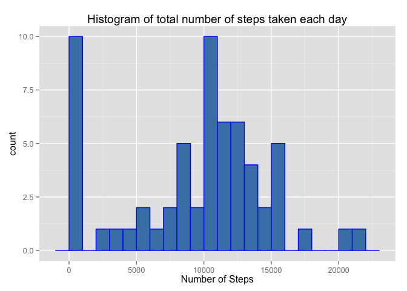
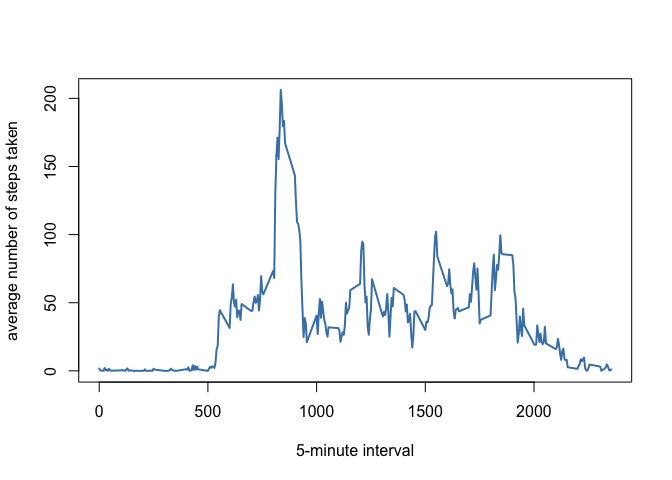
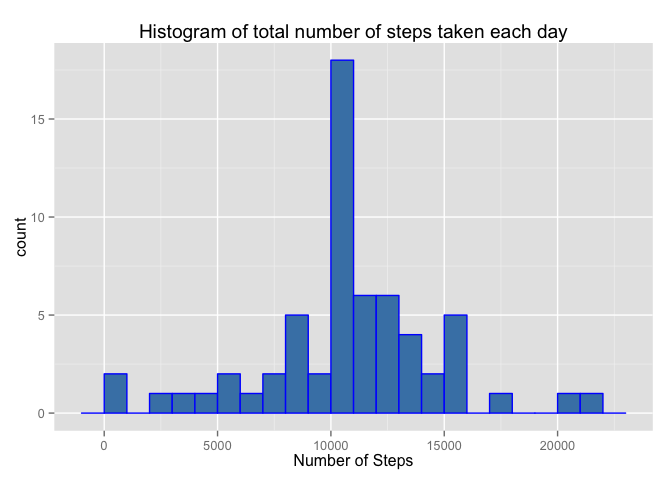
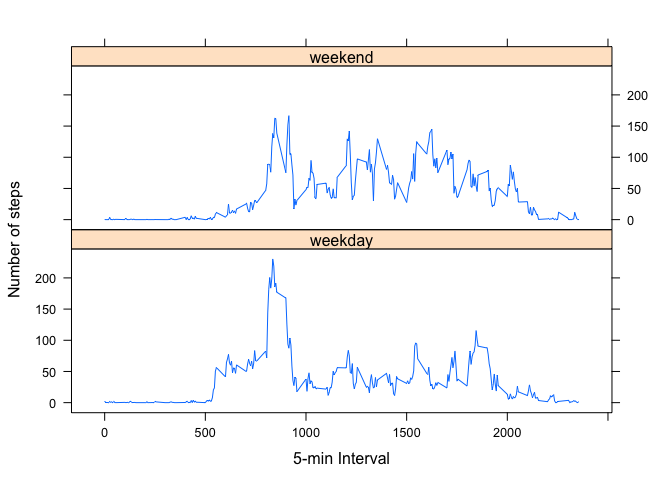

# Reproducible Research: Peer Assessment 1
### Global Settings

```r
echo = TRUE #Always make code visible 
```

## Loading and preprocessing the data

```r
unzip("activity.zip")
data <- read.csv("activity.csv")
```

## What is mean total number of steps taken per day?

```r
library(ggplot2)
totalSteps <- tapply(data$steps, data$date, FUN=sum, na.rm=TRUE)
qplot(totalSteps, 
      binwidth=1000, 
      main="Histogram of total number of steps taken each day",
      xlab="Number of Steps",
      fill=I("steelblue"), 
      col=I("blue"))
```

 

```r
mean(totalSteps, na.rm=TRUE)
```

```
## [1] 9354.23
```

```r
median(totalSteps, na.rm=TRUE)
```

```
## [1] 10395
```

```r
head(totalSteps)
```

```
## 2012-10-01 2012-10-02 2012-10-03 2012-10-04 2012-10-05 2012-10-06 
##          0        126      11352      12116      13294      15420
```


## What is the average daily activity pattern?

```r
averages <- aggregate(x=list(steps=data$steps), 
                      by=list(interval=data$interval),
                      FUN=mean, 
                      na.rm=TRUE)

##names(averages)[3] <- "meanOfSteps"

plot(averages$interval, 
     averages$steps, 
     type="l", 
     xlab= "5-minute interval", 
     ylab= "average number of steps taken", 
     col="steelblue" , 
     lwd=2)
```

 

```r
averages[which.max(averages$steps),]
```

```
##     interval    steps
## 104      835 206.1698
```
## Imputing missing values

```r
library(xtable)
missing<-table(sum(is.na(data)))
print(xtable(table(missing)), type = "html", include.rownames = FALSE)
```

```
## <!-- html table generated in R 3.1.3 by xtable 1.7-4 package -->
## <!-- Sat May 16 11:10:50 2015 -->
## <table border=1>
## <tr> <th> missing </th>  </tr>
##   <tr> <td align="right">   1 </td> </tr>
##    </table>
```

```r
fixedData <- data 
for (i in 1:nrow(fixedData)) {
        if (is.na(fixedData$steps[i])) {
                fixedData$steps[i] <- averages[which(fixedData$interval[i] == averages$interval), ]$steps
        }
}

head(fixedData)
```

```
##       steps       date interval
## 1 1.7169811 2012-10-01        0
## 2 0.3396226 2012-10-01        5
## 3 0.1320755 2012-10-01       10
## 4 0.1509434 2012-10-01       15
## 5 0.0754717 2012-10-01       20
## 6 2.0943396 2012-10-01       25
```

```r
sum(is.na(fixedData))
```

```
## [1] 0
```

```r
totalStepsFixed <- tapply(fixedData$steps, fixedData$date, FUN=sum)
##qplot(totalStepsFixed, binwidth=1000, xlab="total number of steps taken each day")
qplot(totalStepsFixed, 
      binwidth=1000, 
      main="Histogram of total number of steps taken each day",
      xlab="Number of Steps",
      fill=I("steelblue"), 
      col=I("blue"))
```

 

```r
mean(totalStepsFixed)
```

```
## [1] 10766.19
```

```r
mean(totalSteps)
```

```
## [1] 9354.23
```

```r
mean(totalStepsFixed)-mean(totalSteps)
```

```
## [1] 1411.959
```

```r
median(totalStepsFixed)
```

```
## [1] 10766.19
```

```r
median(totalSteps)
```

```
## [1] 10395
```

```r
median(totalStepsFixed) - median(totalSteps)
```

```
## [1] 371.1887
```


## Are there differences in activity patterns between weekdays and weekends?

```r
fixedData$weekdays <- factor(format(as.Date(fixedData$date), "%A"))
levels(fixedData$weekdays)
```

```
## [1] "Friday"    "Monday"    "Saturday"  "Sunday"    "Thursday"  "Tuesday"  
## [7] "Wednesday"
```

```r
levels(fixedData$weekdays) <- list(weekday = c("Monday", "Tuesday",
                                             "Wednesday", 
                                             "Thursday", "Friday"),
                                 weekend = c("Saturday", "Sunday"))
levels(fixedData$weekdays)
```

```
## [1] "weekday" "weekend"
```

```r
table(fixedData$weekdays)
```

```
## 
## weekday weekend 
##   12960    4608
```

```r
print(xtable(table(fixedData$weekdays)), type = "html", include.rownames = FALSE)
```

```
## <!-- html table generated in R 3.1.3 by xtable 1.7-4 package -->
## <!-- Sat May 16 11:10:51 2015 -->
## <table border=1>
## <tr> <th> V1 </th>  </tr>
##   <tr> <td align="right"> 12960 </td> </tr>
##   <tr> <td align="right"> 4608 </td> </tr>
##    </table>
```

```r
averagesFixed <- aggregate(fixedData$steps, 
                      list(interval = as.numeric(as.character(fixedData$interval)), 
                           weekdays = fixedData$weekdays),
                      FUN = "mean")
names(averagesFixed)[3] <- "meanOfSteps"

library(lattice)
xyplot(averagesFixed$meanOfSteps ~ averagesFixed$interval | averagesFixed$weekdays, 
       layout = c(1, 2), type = "l", 
       xlab = "5-min Interval", ylab = "Number of steps")
```

 
