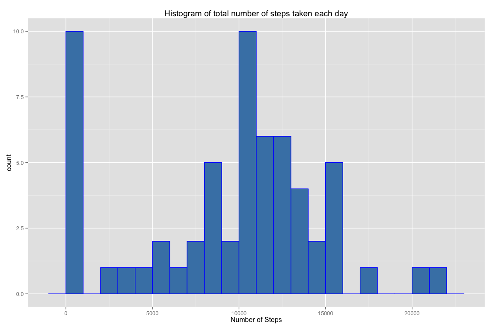
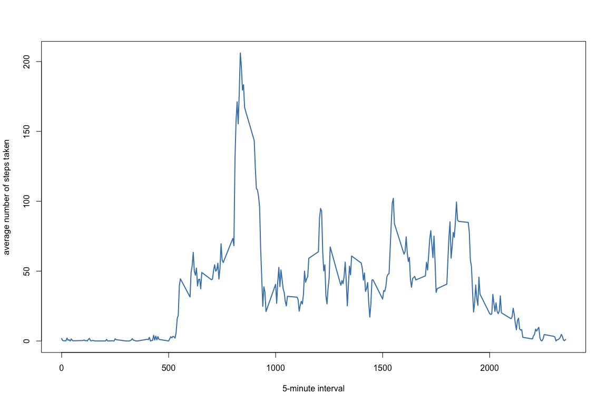
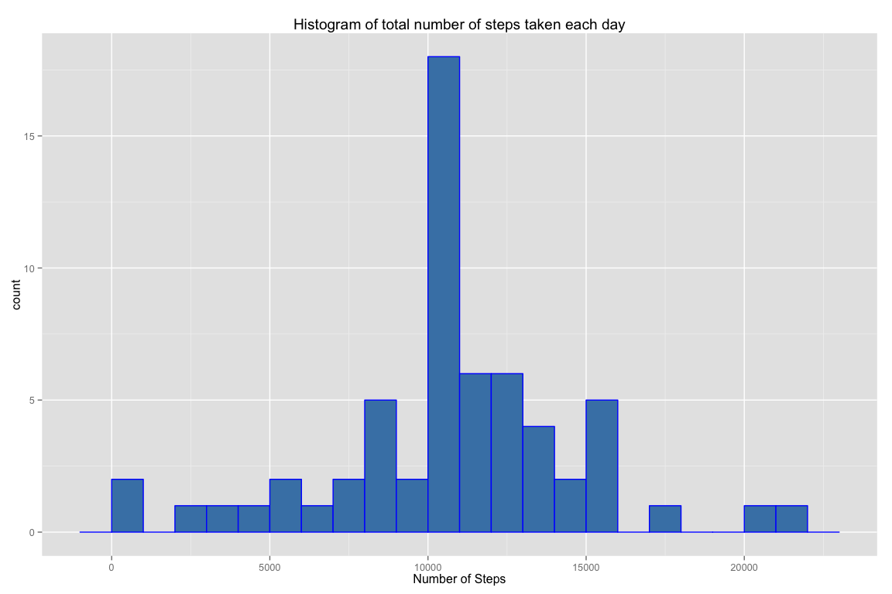
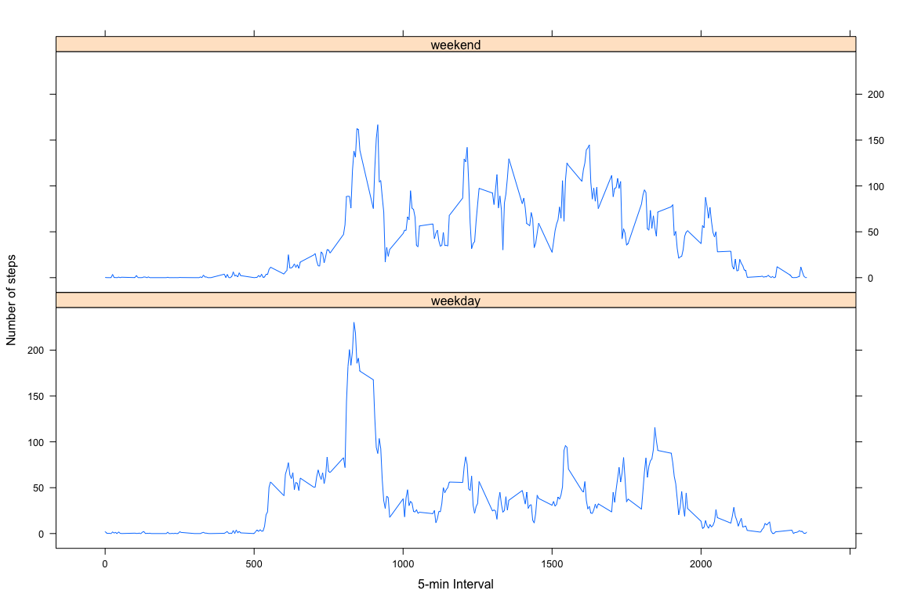

# Reproducible Research: Peer Assessment 1
### Global Settings

```r
knitr::opts_chunk$set(fig.width=12, fig.height=8, fig.path='figure/',
                      echo=TRUE, warning=FALSE, message=FALSE)
```

## Loading and preprocessing the data

Load the dataset and get it ready to be processed.

```r
unzip("activity.zip")
data <- read.csv("activity.csv")
```

## What is mean total number of steps taken per day?

This step calculates the mean and median for total steps taken per day and plots a histogram.


```r
library(ggplot2)
totalSteps <- tapply(data$steps, data$date, FUN=sum, na.rm=TRUE)
qplot(totalSteps, 
      binwidth=1000, 
      main="Histogram of total number of steps taken each day",
      xlab="Number of Steps",
      fill=I("steelblue"), 
      col=I("blue"))
```

 

Here is sample of totalSteps

```r
head(totalSteps)
```

```
## 2012-10-01 2012-10-02 2012-10-03 2012-10-04 2012-10-05 2012-10-06 
##          0        126      11352      12116      13294      15420
```

Mean for total number of steps taken per day:

```r
mean(totalSteps, na.rm=TRUE)
```

```
## [1] 9354.23
```

Median for total number of steps taken per day:

```r
median(totalSteps, na.rm=TRUE)
```

```
## [1] 10395
```


## What is the average daily activity pattern?

This time series shows the average daily activity pattern across all days.

```r
averages <- aggregate(x=list(steps=data$steps), 
                      by=list(interval=data$interval),
                      FUN=mean, 
                      na.rm=TRUE)

plot(averages$interval, 
     averages$steps, 
     type="l", 
     xlab= "5-minute interval", 
     ylab= "average number of steps taken", 
     col="steelblue" , 
     lwd=2)
```

 

We neeed to find the inverval containing the max number of steps. 

```r
intervalMax <- averages[which.max(averages$steps),]
intervalMax
```

```
##     interval    steps
## 104      835 206.1698
```

On average across all the days in the dataset, interval ``835`` contains the maximum number of steps ``206.1698113``


## Imputing missing values
There are many days/intervals where there are missing values (coded as `NA`). The presence of missing days may introduce bias into some calculations or summaries of the data. 

The strategy I am using will populate the  steps column that are NA with the mean for that 5-minute interval.  

Get a count of missing values (NA's)

```r
missing<-table(sum(is.na(data)))
missing
```

```
## 
## 2304 
##    1
```

All of the missing values will be filled in with mean value for that 5-minute
interval.


```r
fixedData <- data 
for (i in 1:nrow(fixedData)) {
        if (is.na(fixedData$steps[i])) {
                fixedData$steps[i] <- averages[which(fixedData$interval[i] == averages$interval), ]$steps
        }
}

head(fixedData)
```

```
##       steps       date interval
## 1 1.7169811 2012-10-01        0
## 2 0.3396226 2012-10-01        5
## 3 0.1320755 2012-10-01       10
## 4 0.1509434 2012-10-01       15
## 5 0.0754717 2012-10-01       20
## 6 2.0943396 2012-10-01       25
```

```r
sum(is.na(fixedData))
```

```
## [1] 0
```

Create a histogram of the total number of steps taken each day and calulate the mean and median for the total number of steps using the fixed data set.  


```r
totalStepsFixed <- tapply(fixedData$steps, fixedData$date, FUN=sum)
##qplot(totalStepsFixed, binwidth=1000, xlab="total number of steps taken each day")
qplot(totalStepsFixed, 
      binwidth=1000, 
      main="Histogram of total number of steps taken each day",
      xlab="Number of Steps",
      fill=I("steelblue"), 
      col=I("blue"))
```

 

Calulate the mean and median for both datasets and compare them.  


```r
mean(totalStepsFixed)
```

```
## [1] 10766.19
```

```r
mean(totalSteps)
```

```
## [1] 9354.23
```

```r
mean(totalStepsFixed)-mean(totalSteps)
```

```
## [1] 1411.959
```

```r
median(totalStepsFixed)
```

```
## [1] 10766.19
```

```r
median(totalSteps)
```

```
## [1] 10395
```

```r
median(totalStepsFixed) - median(totalSteps)
```

```
## [1] 371.1887
```

The Mean and median values are higher after imputing missing data.  The orignal data contained `steps` with `NA` values and those calcualted as zeros (0) by default.  After imputing the missing values using the mean `steps` of the associated `interval` value, the zeros (0) values are removed.  

## Are there differences in activity patterns between weekdays and weekends?

This code will find the day of the week for each measurement in the fixed dataset.

Create a new factor variable in the dataset with two levels – “weekday” and “weekend” indicating whether a given date is a weekday or weekend day.


```r
fixedData$weekdays <- factor(format(as.Date(fixedData$date), "%A"))
levels(fixedData$weekdays)
```

```
## [1] "Friday"    "Monday"    "Saturday"  "Sunday"    "Thursday"  "Tuesday"  
## [7] "Wednesday"
```

```r
levels(fixedData$weekdays) <- list(weekday = c("Monday", "Tuesday",
                                             "Wednesday", 
                                             "Thursday", "Friday"),
                                 weekend = c("Saturday", "Sunday"))
levels(fixedData$weekdays)
```

```
## [1] "weekday" "weekend"
```

```r
table(fixedData$weekdays)
```

```
## 
## weekday weekend 
##   12960    4608
```

Make a panel plot containing plots of average number of steps taken on weekdays and weekends.


```r
averagesFixed <- aggregate(x=list(steps=fixedData$steps), 
                      list(interval = as.numeric(as.character(fixedData$interval)), 
                           weekdays = fixedData$weekdays),
                      FUN = "mean")
#names(averagesFixed)[3] <- "meanOfSteps"

library(lattice)
xyplot(averagesFixed$steps ~ averagesFixed$interval | averagesFixed$weekdays, 
       layout = c(1, 2), type = "l", 
       xlab = "5-min Interval", ylab = "Number of steps")
```

 
